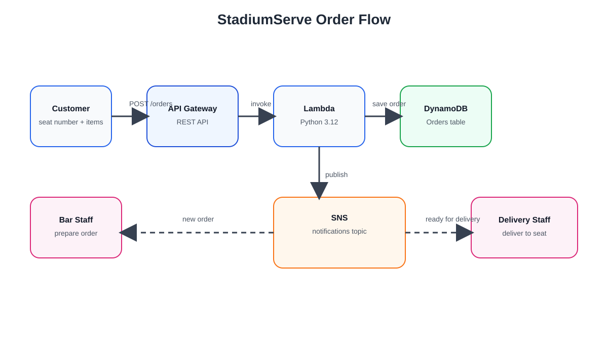

# StadiumServe — In-Seat Bar Delivery System

## Problem Statement

At DHL Stadium (and similar large venues), match-day bars experience heavy congestion.
Long queues at the bar mean fans who want food or drinks either miss part of the game
or give up on ordering entirely. There is currently no way for a seated customer to
order from the bar without physically joining the queue.

**StadiumServe** solves this by letting customers order from their seat via a simple
web app. Orders are routed to bar staff for preparation, and once ready, delivery
staff are notified with the order details and seat number so they can hand-deliver
the order — no queueing required.

## System Actors

1. **Customer** — places an order from their seat (seat number + items)
2. **Bar Staff** — receives new orders, prepares them, updates status to "preparing" → "ready"
3. **Delivery Staff** — receives notification once an order is ready, delivers it to the seat, marks it "delivered"

## Order Lifecycle

```
pending → preparing → ready → out_for_delivery → delivered
```

## High-Level Architecture

See [images/architecture-diagram.svg](images/architecture-diagram.svg) and [ARCHITECTURE.md](ARCHITECTURE.md) for the full breakdown.



- **Frontend:** Static site on S3 + CloudFront (customer order form, bar dashboard, delivery dashboard)
- **API:** Amazon API Gateway (REST)
- **Compute:** AWS Lambda — **Python 3.12** (Java may be used for an optional secondary service if needed)
- **Data:** Amazon DynamoDB (single `Orders` table)
- **Notifications:** Amazon SNS (bar-staff topic, delivery-staff topic)

## Tech Stack

- **Backend (Lambdas):** Python 3.12, `boto3`
- **Optional Java component:** if a separate service is added later (e.g. a receipt/report generator), it will run as its own Lambda using Java 17 — kept isolated so it doesn't complicate the main Python flow
- **Frontend:** HTML/CSS/vanilla JS
- **Infra:** AWS Console for v1 (SAM/CloudFormation optional stretch goal)

## Why AWS Serverless

Order volume is spiky — busy right before kickoff and at half-time, quiet otherwise.
Serverless (API Gateway + Lambda + DynamoDB + SNS) scales automatically for the spikes
and costs nothing when idle, matching real match-day usage.

## Project Status

🚧 In progress — WeThinkCode_ AWS elective project. Due 25 Sep 2026.

## Repo Structure (planned)

```
/lambdas

/createOrder      (Python)

/getOrders        (Python)

/updateOrderStatus (Python)

/reportGenerator  (Java — optional, if needed)

/frontend

index.html            # customer order page

bar-dashboard.html

delivery-dashboard.html

architecture-diagram.svg

ARCHITECTURE.md

SCHEMA.md

README.md

```
